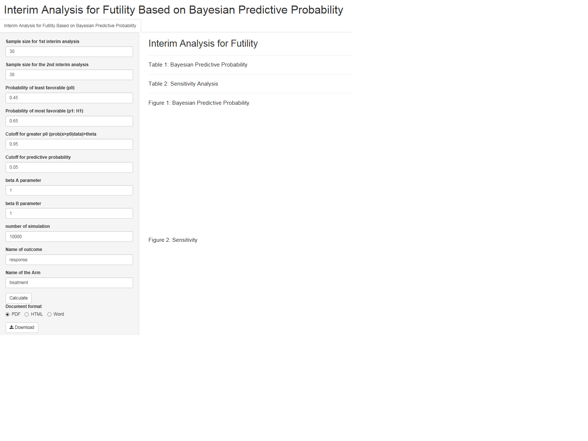
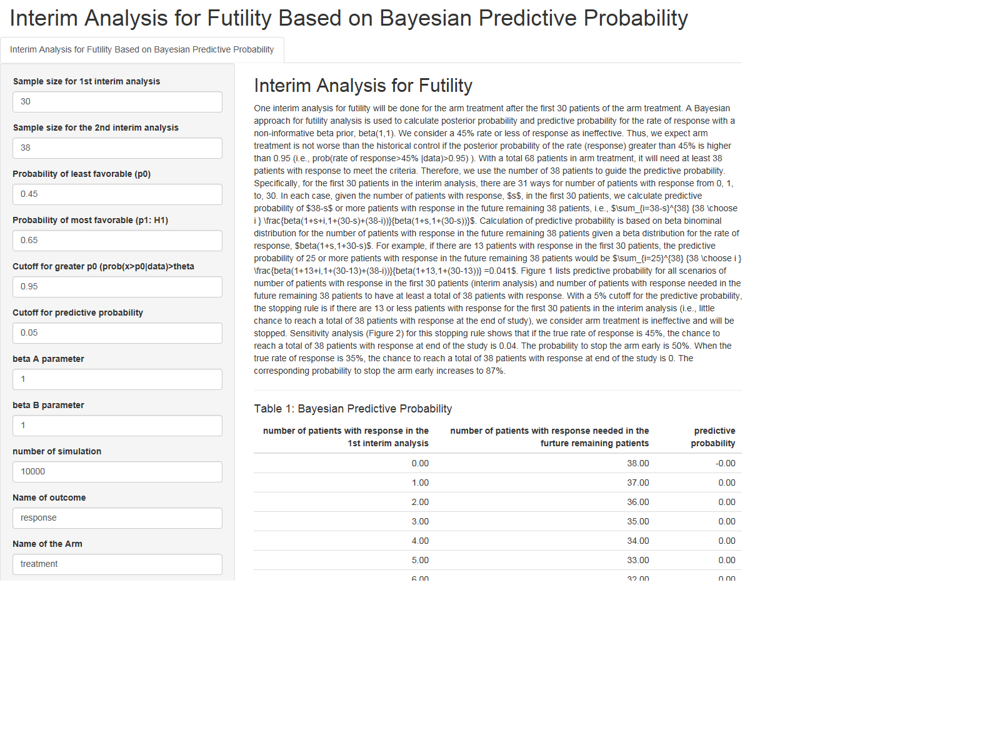
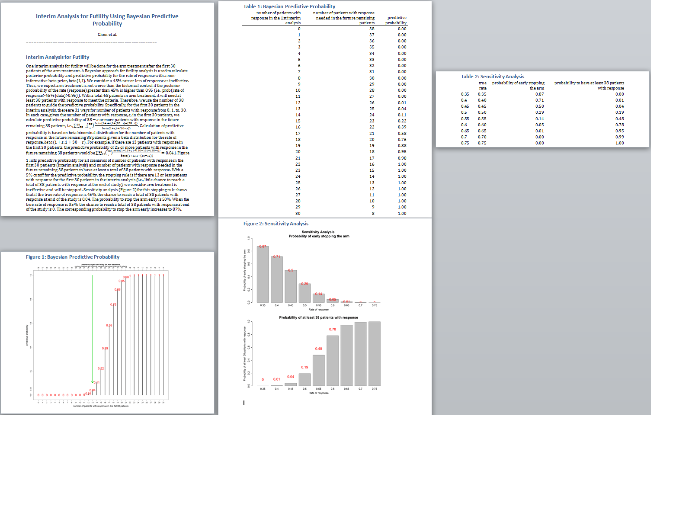

# BayesianPredictiveFutility
The tool calculates power for the Bayesian pick-the-winner design in a randomized phase II clinical trial. It also generates report and statistical plan so clinicians could easily incorporate it into the clinical trial protocol.
(reference: A Bayesian pick-the-winner design in a randomized phase II clinical trial; Chen et al; submitted).

## Features

* The shiny applictaion provides power calculation for the Bayesian pick-the-winner design in a randomized phase II clinical trial and generates a statistical plan to be easily incorporated  into the clinical trial protocol. 

## Installation

Simply run the following from an R console:

```r
if (!require("devtools"))
  install.packages("devtools")
devtools::install_github("dungtsa/BayesianPickWinner",force = TRUE)
```

## Getting Started

```r
require("BayesianPickWinner")
bayes.pick.winner()
```
-------------------------------
Snapshot of shiny app: initial 


-------------------------------
Snapshot of shiny app: output


-------------------------------
Snapshot of shiny app: output in Word format (through "download" button)

