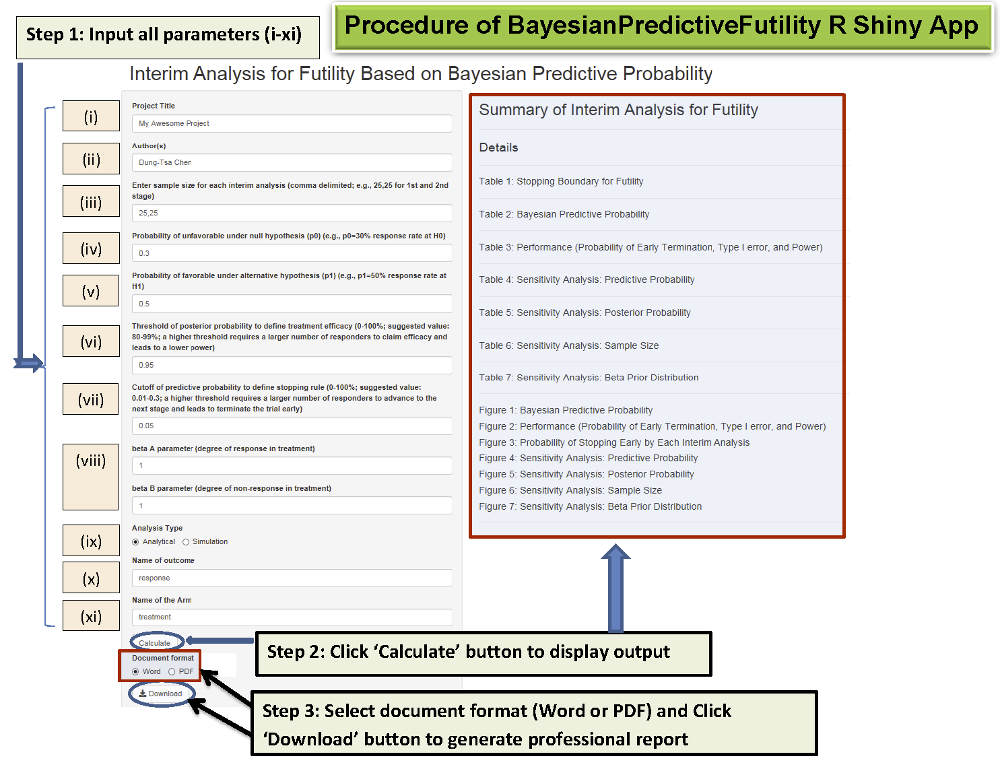

# BayesianPredictiveFutility
The tool provides futility interim analysis plan using the Bayesian predictive design in single arm early  phase II clinical trial. It also generates  statistical plan so clinicians could easily incorporate it into the clinical trial protocol.
(reference: Application of Bayesian predictive probability for interim analysis in single-arm early phase II trial. Chen et al; submitted).


## Features

* The shiny applictaion provides futility interim analysis plan for the Bayesian predictive design design in single arm early  phase II clinical trial and generates a statistical plan to be easily incorporated  into the clinical trial protocol. 

## Installation

Simply run the following from an R console:

```r
cred = git2r::cred_ssh_key(
	publickey = "MYPATH/.ssh/id_rsa.pub", 
	privatekey = "MYPATH/.ssh/id_rsa")

devtools::install_git("git@gitlab.moffitt.usf.edu:petterhf/BayesianPredFutilPkg.git", 
					  credentials = cred)
```

## Getting Started

```r
library("BayesianPredictiveFutility")
Bayesian_Predictive_App()
```

-------------------------------
Procedure of BayesianPredictiveFutility R Shiny App  


-------------------------------
Example of two-stage case

